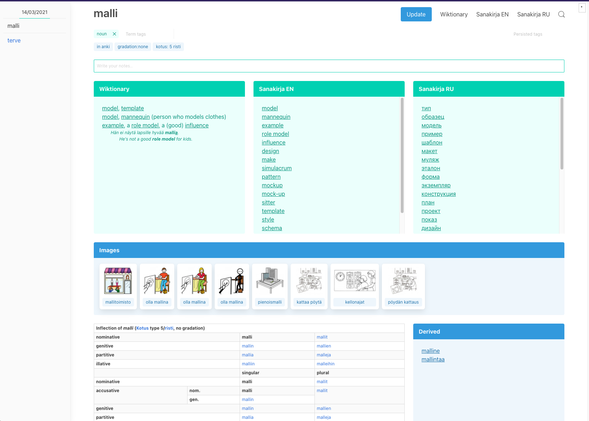
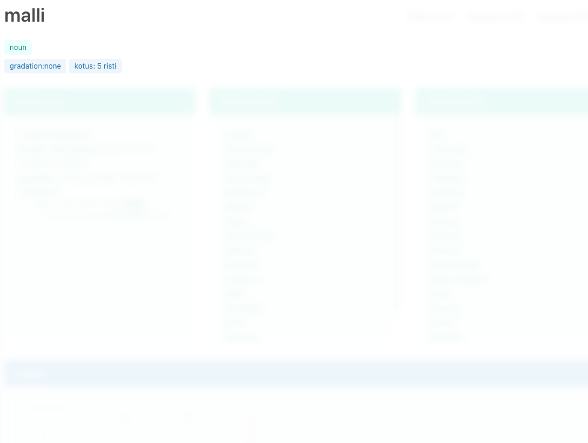
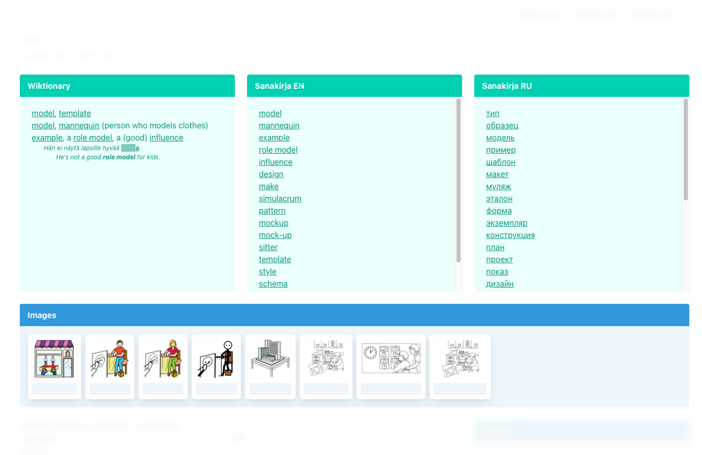
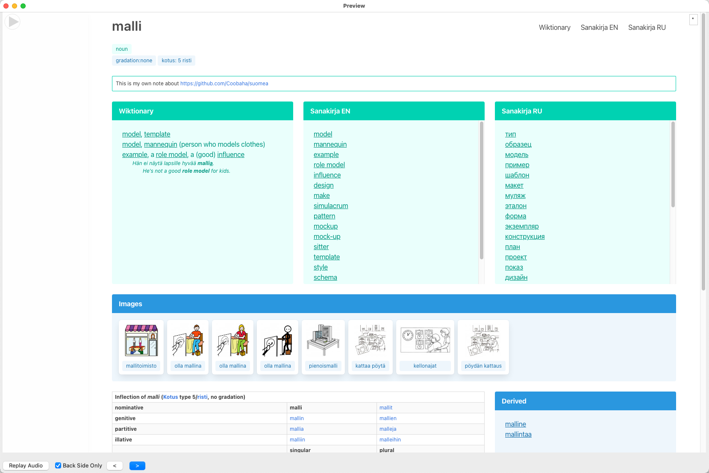
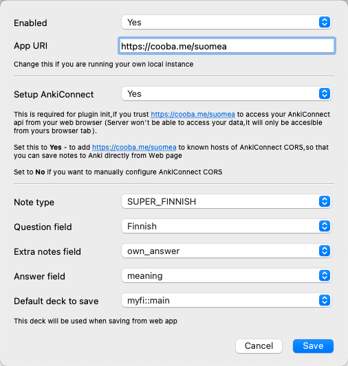

<h1 align="center">Welcome to Learning Finnish 👋</h1>

> Set of tools to learn Finnish. Includes web app, Anki plugin that integrates
> with web app and Alfred workflow

### 📽 Demo

This gif shows main features:

- web integration with Anki
  - extra data from anki
  - saving term back to anki
- alfred workflow
  - opens same web app tab
  - can save terms directly to anki
  - can be used for quick lookups
- anki plugin
  - question/answer context
  - renders web app


### 🏠 [Web app](https://cooba.me/suomea)

Renders data from different sources nicely


- Has search (<kbd>CMD/CTRL + K</kbd> or <kbd>/</kbd> for quick access)
- Can connect to anki via plugin
  - save data to Anki from web page
  - load extra data from Anki (tags, own notes, etc)
- Aware of Anki context
  - will hide answer parts 
  - reversed mode is also supported 

### 💬 [Anki Plugin](https://ankiweb.net/shared/addons/2045459309)

Makes it possible to use web app for reviewing notes


- saving notes from web app directly to anki

- enhances web app with notes data (such as tags, own notes, etc)

- configurable, you can easily plug it in your existing collection (🤞)

### 🚀 [Alfred Workflow](https://www.npmjs.com/package/@coobaha/alfred-anki)

Not yet published, but can be installed & used from sources

- quick word lookups
- opens same browser tab
- can save data to anki

## Install

The installation process is similar to other Anki plugins and can be
accomplished in three steps:

1. Open the `Install Add-on` dialog by selecting `Tools` | `Add-ons` |
   `Get Add-ons...` in Anki.
1. Input [2045459309](https://ankiweb.net/shared/info/2045459309) into the text
   box labeled `Code` and press the `OK` button to proceed.
1. Navigate to plugin settings `Tools` | `Add-ons` | Select `AnkiSuomea` in the
   list | `Config (or double click)`
1. Important configuration notes: 
   - Plugin is disabled by default, so you need to enable it
   - You can enable auto setup of
     [AnkiConnect](https://ankiweb.net/shared/info/2055492159)
     - Installs plugin
     - Adds configured App URI to CORS list
1. Restart Anki to complete the installation of AnkiFinnish.

Anki must be kept running in the background in order for web app to be able to
use AnkiFinnish. AnkiConnect recommends this setup

> ###Notes for Windows Users
>
> Windows users may see a firewall nag dialog box appear on Anki startup. This
> occurs because AnkiConnect runs a local HTTP server in order to enable other
> applications to connect to it. The host application, Anki, must be unblocked
> for this plugin to function correctly.
>
> Notes for Mac OS X Users Starting with Mac OS X Mavericks, a feature named App
> Nap has been introduced to the operating system. This feature causes certain
> applications which are open (but not visible) to be placed in a suspended
> state. As this behavior causes AnkiConnect to stop working while you have
> another window in the foreground, App Nap should be disabled for Anki:
>
> Start the Terminal application. Execute the following commands in the terminal
> window:
>
> ```
> defaults write net.ankiweb.dtop NSAppSleepDisabled -bool true
> defaults write net.ichi2.anki NSAppSleepDisabled -bool true
> defaults write org.qt-project.Qt.QtWebEngineCore NSAppSleepDisabled -bool true
> ```
>
> Restart Anki.

### Misc

This plugin plays well with
[AwesomeTTS](https://ankiweb.net/shared/info/1436550454)

After installation, you can add this to front template (macOS), for Windows
please check [docs](https://ankiatts.appspot.com/services)

```html
<div style="position: fixed; opacity: 0.2; top: 0; left: 0;">
  {{tts fi_FI voices=Apple_Satu:Finnish}}
</div>
```

## Author

👤 **Alexander Ryzhikov**

- Twitter: [@Coobaha](https://twitter.com/Coobaha)
- Github: [@Coobaha](https://github.com/Coobaha)
- LinkedIn: [@ryzhikov](https://linkedin.com/in/ryzhikov)

## Show your support

Give a ⭐️ if this project helped you!
